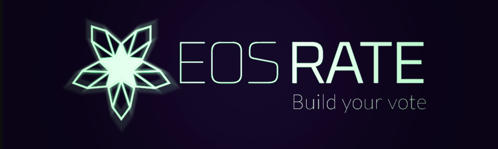
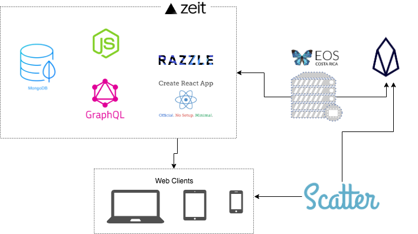

<p align="center">
	<a href="https://travis-ci.org/eoscostarica/rate.eoscostarica.io">
		
	</a>
	<a href="http://standardjs.com">
		
	</a>
	<a href="https://git.io/col">
		
	</a>
	<a href="https://discord.gg/bBpQHym">
		
	</a>
	<a href="https://twitter.com/intent/follow?screen_name=eoscostarica">
		
	</a>
	<a href="#">
		
	</a>
</p>

<p align="center">
	<a href="https://eoscostarica.io">
		
	</a>
</p>
<br/>


# EOS Rating Portal - Community based rating system.

Community driven EOS Block Producer ratings website.

<p align="center">
	
</p>

## Contributing

We use a Kanban-style board with built-in triggers to automatically move issues and pull requests across New Issues, To Do, In Progress and Done columns. That's were we prioritize the work. [Go to Project Board](https://github.com/eoscostarica/rate.eoscostarica.io/projects/1).

We follow the [open source collaborative ettiquete](https://github.com/rstacruz/collaborative-etiquette/blob/master/README.md#top), the [standardjs code style](https://standardjs.com) and we favor [functional javascript programming](https://www.youtube.com/watch?v=BMUiFMZr7vk&list=PL0zVEGEvSaeEd9hlmCXrk5yUyqUag-n84) and declative code style.

Read the [contributing guidelines](CONTRIBUTING.md) for details.

Our weekly sync call is every Monday 7pm-8pm CST / Costa Rica on google hangouts. [Go to hangouts room](http://bit.ly/dmeetup-call)

## Bug Reporting

Please report bugs big and small by [opening an issue](https://github.com/eoscostarica/dmeetup/issues). No possible bug report is too small.

## Architecture

- We are going start with a MongoDB on the cloud to ratings replica data store for fast queries.
- Once the new racks are in place and we have a node with history plugin we can query that mongodb instead.
- Rating will only be possible on desktop thru scatter in the first version.
- Mobile will be read only for now.

First Phase



Second Phase


## User Flow

- Just ignore the login/signup part ( we'll use scatter instead )


## Project Directory Structure

```
.
├── docs/ ............................................. documentation files and media
├── server/ ........................................... all server side code (we will cover in detail soon)
├── webapp/ ........................................... all client side code
|	├── public/ ....................................... static and public files
|	├── src/ .......................................... application source code (we will cover in detail soon)
|	├── package.json .................................. dependencies manifest
|	├── docker-compose.yaml ........................... docker compose for local smart contracts development
|	├── config-overrides.js ........................... configuration overrides for `create-react-app`
|	├── .env .......................................... environment variables (for local development)
|	└── .eslintrc ..................................... code style rules
├── docs/ .............................................. documentation files and media
├── public/ ............................................ static and public files
├── src/ ............................................... application source code (we will cover in detail soon)
├── CONTRIBUTING.md .................................... contributing guidelines
├── LICENSE ............................................ project license
├── README.md .......................................... project homepage
├── package.json ....................................... dependencies manifest
├── docker-compose.yaml ................................ docker compose for local smart contracts development
├── config-overrides.js ................................ configuration overrides for `create-react-app`
└── .travis.yml ........................................ travis ci configuration file
```

# React App Components

- [react-app-rewired](https://github.com/timarney/react-app-rewired) for tweaking `create-react-app` configuration without ejecting
- [reach-router](https://github.com/reach/router) for a more accessible router.
- state management with [rematch](https://github.com/rematch/rematch) to use `redux` best practices without all the boilerplate.

## Continuous Integration Process

We follow a continuous integration process based on Github flow that leverages the following tools:

- [TravisCI](https://travis-ci.org/) to run test and code style checks
- [Now.sh](https://now.sh) for continuous delivery to the stanging server and creation pull request specific environments for testing. awesome!
- [Code Factor](https://codefactor.io) for automated code quality reviews.

## About EOS Costa Rica

EOS Blockchain is aiming to become a decentralized operating system which can support large-scale decentralized applications.

EOS Costa Rica supports the EOS.io community by maintaining and contributing to open source initiatives, meetups and workshops.

We challenge ourselves to provide the EOS platform with a strong geographical and political diversity by running the most robust EOS Block Producer possible from Costa Rica; We pledge to leverage our talent, experience, and sustainable internet resources to meet such an important challenge.

[eoscostarica.io](https://eoscostarica.io)

## License

MIT © [EOS Costa Rica](https://eoscostarica.io)

## Contributors

Thanks goes to these wonderful people ([emoji key](https://github.com/kentcdodds/all-contributors#emoji-key)):

<!-- ALL-CONTRIBUTORS-LIST:START - Do not remove or modify this section -->
<!-- prettier-ignore -->
| [<br /><sub><b>Gabo Esquivel</b></sub>](https://gaboesquivel.com)<br />[🤔](#ideas-gaboesquivel "Ideas, Planning, & Feedback") [📖](https://github.com/eoscostarica/eosrate/commits?author=gaboesquivel "Documentation") [💻](https://github.com/eoscostarica/eosrate/commits?author=gaboesquivel "Code") [👀](#review-gaboesquivel "Reviewed Pull Requests") | [<br /><sub><b>Jorge Murillo</b></sub>](https://github.com/murillojorge)<br />[🤔](#ideas-murillojorge "Ideas, Planning, & Feedback") [📖](https://github.com/eoscostarica/eosrate/commits?author=murillojorge "Documentation") [🎨](#design-murillojorge "Design") [💻](https://github.com/eoscostarica/eosrate/commits?author=murillojorge "Code") [👀](#review-murillojorge "Reviewed Pull Requests") | [<br /><sub><b>Daniel Prado</b></sub>](https://github.com/danazkari)<br />[💻](https://github.com/eoscostarica/eosrate/commits?author=danazkari "Code") [📖](https://github.com/eoscostarica/eosrate/commits?author=danazkari "Documentation") [🤔](#ideas-danazkari "Ideas, Planning, & Feedback") [👀](#review-danazkari "Reviewed Pull Requests") | [<br /><sub><b>Xavier Fernandez</b></sub>](https://github.com/xavier506)<br />[🤔](#ideas-xavier506 "Ideas, Planning, & Feedback") [📝](#blog-xavier506 "Blogposts") [📢](#talk-xavier506 "Talks") [🚇](#infra-xavier506 "Infrastructure (Hosting, Build-Tools, etc)") | [<br /><sub><b>Edgar Fernandez</b></sub>](http://www.eoscostarica.io)<br />[🤔](#ideas-edgar-eoscostarica "Ideas, Planning, & Feedback") [📝](#blog-edgar-eoscostarica "Blogposts") [📢](#talk-edgar-eoscostarica "Talks") | [<br /><sub><b>Rubén Abarca Navarro</b></sub>](https://github.com/rubenabix)<br />[🤔](#ideas-rubenabix "Ideas, Planning, & Feedback") [💻](https://github.com/eoscostarica/eosrate/commits?author=rubenabix "Code") [👀](#review-rubenabix "Reviewed Pull Requests") | [<br /><sub><b>roafroaf</b></sub>](https://github.com/roafroaf)<br />[🤔](#ideas-roafroaf "Ideas, Planning, & Feedback") [🎨](#design-roafroaf "Design") |
| :---: | :---: | :---: | :---: | :---: | :---: | :---: |
<!-- ALL-CONTRIBUTORS-LIST:END -->

This project follows the [all-contributors](https://github.com/kentcdodds/all-contributors) specification. Contributions of any kind welcome!