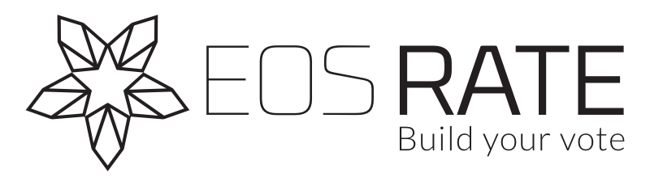
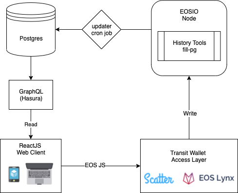
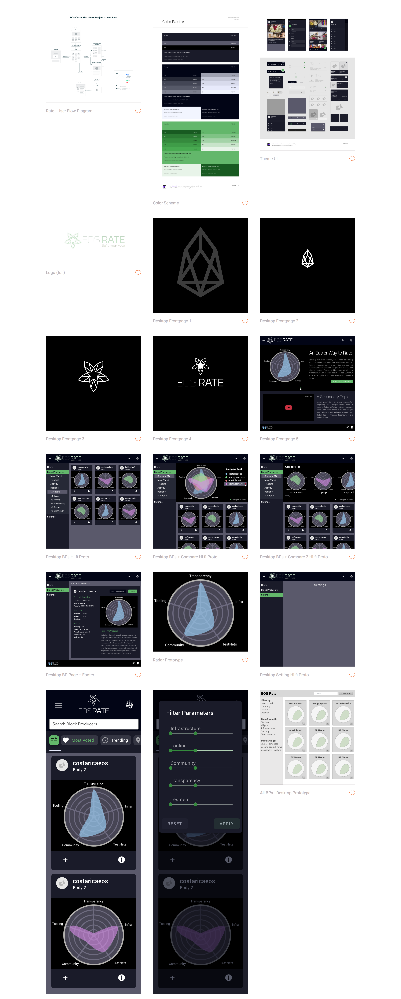
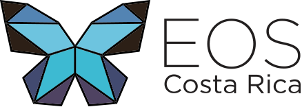

<p align="center">
	<a href="https://travis-ci.org/eoscostarica/rate.eoscostarica.io">
		
	</a>
	<a href="http://standardjs.com">
		
	</a>
	<a href="https://git.io/col">
		
	</a>
	<a href="https://discord.gg/bBpQHym">
		
	</a>
	<a href="https://twitter.com/intent/follow?screen_name=eoscostarica">
		
	</a>
	<a href="#">
		
	</a>
</p>

<p align="center">
	
</p>

# A Rating Portal for the EOS Community

EOS Rate is a community-driven visual rating tool that allows EOS token holders to easily rate Block Producers in distinct categories.

The rating system is based on a radial graph representing the most important qualitative aspects (let’s call them categories) of a block producer, populated with ratings provided by the input if the EOS community, and stored on the blockchain.

It will also provide basic quantitative information, a compare tool, dynamic filtering and links related to each BP (block producer), in order to fully inform the potential voter, but also let them share their ratings.

Each EOS account can submit their rating for each BP as many times as they like facilitating a "liquid democracy", however, the weighting is independent from the amount the EOS account holds. One account = one submission of equal weight.

<!-- START doctoc generated TOC please keep comment here to allow auto update -->
<!-- DON'T EDIT THIS SECTION, INSTEAD RE-RUN doctoc TO UPDATE -->

- [Test Environment](#test-environment)
- [Feature Roadmap](#feature-roadmap)
- [Architecture](#architecture)
- [App Services](#app-services)
- [Development Setup](#development-setup)
  - [Install Global Dependencies](#install-global-dependencies)
  - [Run EOS Rate on your Computer](#run-eos-rate-on-your-computer)
- [Design Assets](#design-assets)
- [Contributing](#contributing)
- [About EOS Costa Rica](#about-eos-costa-rica)
- [License](#license)
- [Contributors](#contributors)

<!-- END doctoc generated TOC please keep comment here to allow auto update -->

## Test Environment

We are testing this application on the [Jungle TestNet](https://jungletestnet.io).  
This UI is currently available at https://eosrate.netlify.com.  
The Smart Contract is code deployed under the account [eoseosrateio](https://jungle.bloks.io/account/eoseosrateio).  
We are running a demux and hasura on premises in Costa Rica.

## Feature Roadmap

**Version 1.0**

- List and Search Block Producers.
- Scatter and Lynx Integration.
- Autogenerated Block Producer profile pages with
  - BPJSON info.
  - Ratings results.
  - Rating UI for token holders to rate that block producer.
- Compare Block Producers page
- Ability to superpose different BPs ratings flake charts.
- Home page with explanation and instructions.
- Languages: English & Spanish.

**Version 1.2**

- Light Theme.
- Activity Stream.
- Ability to leave a comment when rating. ( reviews, like Yelp ).
- Ability to vote for a block producer directly on their profile page.
- Languages: Chinese and Korean.
- Filtering Block Producer List.
  - by Strengths: transparency, community, infra...
  - by Region.

**Version 1.3**

- Proxies landing page with:
  - Proxy list from the [eosio.system](https://github.com/EOSIO/eos/tree/master/contracts/eosio.system) voters tables.
  - Proxy Info from the [eos-proxyinfo](https://github.com/AlohaEOS/eos-proxyinfo) contract.
  - Ability to vote for the proxy.
- Voice identity layer for EOSRATE
- List and search proxies.

## Architecture

<p align="center">
	
</p>

## App Services

- **frontend:** http://localhost:3000  
  A React JS Web Client based on create-react-app that starts up at the available port (default is 3000).

- **[hasura](https://hasura.io)** http://localhost:8088  
  Autogenerated GraphQL API based on the PostgresDB Schema.
  Run `make hasura` to start the management console.

- **pgweb:** http://localhost:8082  
  Web-based PostgreSQL database browser written in Go running on a linux alpine container.

- **updater:**
  Cron Job that periodically synchronises BP data from blockchain and bp.JSON files.

- **EOSIO Node:** https://api.eosio.cr
  <br/>[`fill-pg`](https://github.com/EOSIO/history-tools#fill-pg) fills postgresql with data from nodeos's State History Plugin.

_Note: This project is based on [EOS DApp Boilerplate](https://github.com/eoscostarica/eos-dapp-boilerplate)._

## Development Setup

Basic knowledge about Docker, Docker Compose, EOSIO and NodeJS is required.

- Video tutorial [Docker Containers | Learn Docker Basics in 30 Mins](https://www.youtube.com/watch?v=0kwXLcwUw0Q)

### Install Global Dependencies

- Docker https://docs.docker.com/install/.  
  At least 10GB RAM (Docker -> Preferences -> Advanced -> Memory -> 10GB or above)
- Hasura CLI https://docs.hasura.io/1.0/graphql/manual/hasura-cli/install-hasura-cli.html
- EOSIO Binaries https://github.com/eosio/eos.  
  This will allow you to `cleos` and `koesd` directly on host machine.
- EOSIO.CDT https://github.com/eosio/eosio.cdt.  
  This will allow you to compile the contracts directly on host machine.

### Run EOS Rate on your Computer

```
git clone git@github.com:eoscostarica/eos-rate.git
cd eos-rate
make start
```

## Design Assets

[Zeplin Artboards](https://scene.zeplin.io/project/5a58ea3341f76658994e000c)



## Contributing

We use a Kanban-style board. That's were we prioritize the work. [Go to Project Board](https://github.com/eoscostarica/eos-rate/projects/1).

Contributing Guidelines https://developers.eoscostarica.io/docs/open-source-guidelines.

Please report bugs big and small by [opening an issue](https://github.com/eoscostarica/eos-rate/issues)

## About EOS Costa Rica

<p align="center">
	<a href="https://eoscostarica.io">
		
	</a>
</p>
<br/>

EOS Costa Rica is an independently-owned, self-funded, bare-metal Genesis block producer that provides stable and secure infrastructure for EOSIO blockchains. We support open source software for our community while offering enterprise solutions and custom smart contract development for our clients.

[eoscostarica.io](https://eoscostarica.io)

## License

MIT © [EOS Costa Rica](https://eoscostarica.io)

## Contributors

Thanks goes to these wonderful people ([emoji key](https://github.com/kentcdodds/all-contributors#emoji-key)):

<!-- ALL-CONTRIBUTORS-LIST:START - Do not remove or modify this section -->
<!-- prettier-ignore-start -->
<!-- markdownlint-disable -->
<table>
  <tr>
    <td align="center"><a href="https://gaboesquivel.com"><br /><sub><b>Gabo Esquivel</b></sub></a><br /><a href="#ideas-gaboesquivel" title="Ideas, Planning, & Feedback">🤔</a> <a href="https://github.com/eoscostarica/eosrate/commits?author=gaboesquivel" title="Documentation">📖</a> <a href="https://github.com/eoscostarica/eosrate/commits?author=gaboesquivel" title="Code">💻</a> <a href="#review-gaboesquivel" title="Reviewed Pull Requests">👀</a></td>
    <td align="center"><a href="https://github.com/murillojorge"><br /><sub><b>Jorge Murillo</b></sub></a><br /><a href="#ideas-murillojorge" title="Ideas, Planning, & Feedback">🤔</a> <a href="https://github.com/eoscostarica/eosrate/commits?author=murillojorge" title="Documentation">📖</a> <a href="#design-murillojorge" title="Design">🎨</a> <a href="https://github.com/eoscostarica/eosrate/commits?author=murillojorge" title="Code">💻</a> <a href="#review-murillojorge" title="Reviewed Pull Requests">👀</a></td>
    <td align="center"><a href="https://github.com/danazkari"><br /><sub><b>Daniel Prado</b></sub></a><br /><a href="https://github.com/eoscostarica/eosrate/commits?author=danazkari" title="Code">💻</a> <a href="https://github.com/eoscostarica/eosrate/commits?author=danazkari" title="Documentation">📖</a> <a href="#ideas-danazkari" title="Ideas, Planning, & Feedback">🤔</a> <a href="#review-danazkari" title="Reviewed Pull Requests">👀</a></td>
    <td align="center"><a href="https://github.com/xavier506"><br /><sub><b>Xavier Fernandez</b></sub></a><br /><a href="#ideas-xavier506" title="Ideas, Planning, & Feedback">🤔</a> <a href="#blog-xavier506" title="Blogposts">📝</a> <a href="#talk-xavier506" title="Talks">📢</a> <a href="#infra-xavier506" title="Infrastructure (Hosting, Build-Tools, etc)">🚇</a></td>
    <td align="center"><a href="http://www.eoscostarica.io"><br /><sub><b>Edgar Fernandez</b></sub></a><br /><a href="#ideas-edgar-eoscostarica" title="Ideas, Planning, & Feedback">🤔</a> <a href="#blog-edgar-eoscostarica" title="Blogposts">📝</a> <a href="#talk-edgar-eoscostarica" title="Talks">📢</a></td>
    <td align="center"><a href="https://github.com/rubenabix"><br /><sub><b>Rubén Abarca Navarro</b></sub></a><br /><a href="#ideas-rubenabix" title="Ideas, Planning, & Feedback">🤔</a> <a href="https://github.com/eoscostarica/eosrate/commits?author=rubenabix" title="Code">💻</a> <a href="#review-rubenabix" title="Reviewed Pull Requests">👀</a></td>
    <td align="center"><a href="https://github.com/roafroaf"><br /><sub><b>roafroaf</b></sub></a><br /><a href="#ideas-roafroaf" title="Ideas, Planning, & Feedback">🤔</a> <a href="#design-roafroaf" title="Design">🎨</a></td>
  </tr>
  <tr>
    <td align="center"><a href="https://github.com/JulianAlvarado">
      <br /><sub><b>Julian Alvarado</b></sub></a><br /><a href="https://github.com/eoscostarica/eosrate/commits?author=Julian-Alvarado" title="Ideas, Planning, & Feedback">🤔</a></td>
    <td align="center"><a href="https://arturocr.com"><br /><sub><b>Arturo Campos</b></sub></a><br /><a href="#ideas-arturocr" title="Ideas, Planning, & Feedback">🤔</a> <a href="https://github.com/eoscostarica/eosrate/commits?author=arturocr" title="Code">💻</a> <a href="#review-arturocr" title="Reviewed Pull Requests">👀</a></td>
    <td align="center"><a href="https://github.com/ldrojas">
      <br /><sub><b>Luis Diego Rojas</b></sub></a><br /><a href="https://github.com/eoscostarica/eosrate/commits?author=ldrojas" title="Ideas, Planning, & Feedback">🤔</a></td>
    <td align="center"><a href="https://github.com/royzumbado">
      <br /><sub><b>Roy Zumbado</b></sub></a><br /><a href="https://github.com/eoscostarica/eosrate/commits?author=royzumbado" title="Ideas, Planning, & Feedback">🤔</a></td>
    <td align="center"><a href="https://github.com/tetogomez">
      <br /><sub><b>Teto Gomez</b></sub></a><br /><a href="https://github.com/eoscostarica/eosrate/commits?author=tetogomez" title="Ideas, Planning, & Feedback">🤔</a> <a href="https://github.com/eoscostarica/eosrate/commits?author=tetogomez" title="Code">💻</a> <a href="#review-tetogomez" title="Reviewed Pull Requests">👀</a></td>
  </tr>
</table>

<!-- markdownlint-enable -->

<!-- prettier-ignore-end -->

<!-- ALL-CONTRIBUTORS-LIST:END -->

This project follows the [all-contributors](https://github.com/kentcdodds/all-contributors) specification. Contributions of any kind welcome!
